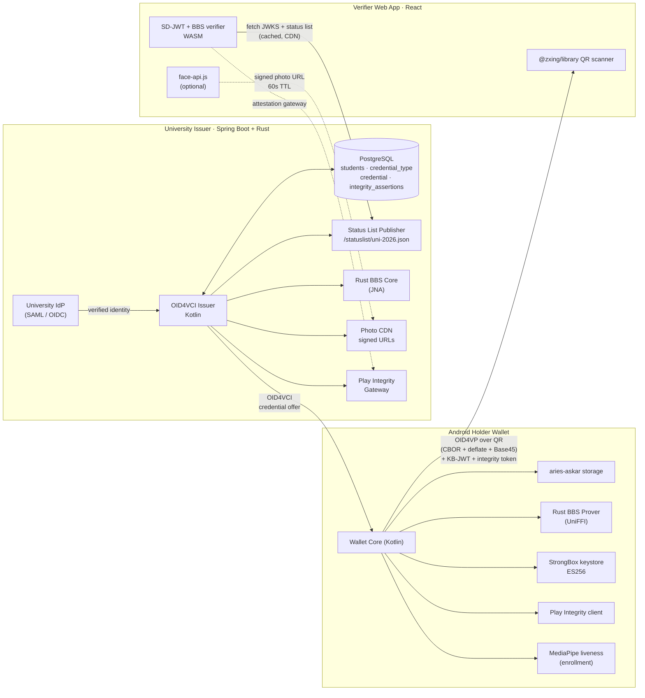

# StudentZK Architecture — v2

> Companion document to `final_plan_md.md`. This file is the short, diagram-first reference. The full rationale, competitive analysis, and risk register live in the plan.

## 1. One-line positioning

A cryptographic credential that proves **a predicate** ("is a student", "is 18+") without revealing identity — verified by machine in milliseconds, usable in unattended QR scanners.

## 2. Three-party flow



## 3. Credential-type-agnostic data model (§5.9)

```
issuer ── 1 ──< credential_type ── 1 ──< credential
                                             │
                        integrity_assertions  │
                                              │
                           (linked by subject_did)
```

Nothing is hardcoded to "student". Any document (library, transit, age proof, event pass) registers a new `credential_type` row with its schema + disclosure policy; the same OID4VCI / OID4VP / Status List pipeline issues and verifies it.

## 4. Disclosed vs. hidden — Student credential v1

| Attribute | Disclosure class |
|---|---|
| `student_id` | always hidden |
| `given_name_hash`, `family_name_hash` | always hidden (raw names live only in `students`) |
| `university_id` | selectively disclosable |
| `photo_hash` | selectively disclosable |
| `is_student` | selectively disclosable |
| `age_equal_or_over.18` | selectively disclosable |
| `valid_until` | always disclosed |

## 5. Key protocol choices

| Layer | Choice | Why (one line) |
|---|---|---|
| Issuance | OpenID4VCI 1.0 | EUDI ARF mandate |
| Presentation | OpenID4VP 1.0 over QR with DCQL | EUDI ARF mandate |
| Primary format | SD-JWT-VC (`draft-ietf-oauth-sd-jwt-vc`) | ARF-mandated, fastest prototype |
| Privacy format | W3C VCDM 2.0 + `bbs-2023` | Cryptographic unlinkability |
| Revocation | IETF Token Status List | Offline-cacheable bitstring |
| QR payload | CBOR → deflate → Base45 | Alphanumeric mode density |
| Device binding | StrongBox ES256 + `cnf` claim | Hard-crypto theft defense |
| Device attestation | Play Integrity (classic) | Blocks rooted/emulated clients |
| Person binding | Liveness + issuer-signed photo hash | Anti-deepfake layer |

## 6. Offline model

Presentation cryptography runs **fully offline** on the holder. The verifier operates against **cached** issuer JWKS + status list, with a freshness badge. Live face-match and live Play Integrity are the two paths that need connectivity — acknowledged, not hidden. See `final_plan §6.5` for the honest per-step table.

## 7. Phase plan (4–6 weeks)

| Phase | Deliverable | Duration |
|---|---|---|
| 0 | Generic credential_type registry · Rust crypto stubs · Play Integrity gateway scaffold | days 1–2 |
| 1 | SD-JWT-VC happy path end-to-end | week 1–2 |
| 2 | BBS+ selective disclosure · StrongBox-bound KB-JWT · real Play Integrity verdict | week 2–4 |
| 3 | Liveness + photo binding · revocation · batch issuance · second credential type · admin UI | week 4–6 |

> *If time compresses, drop BBS and ship SD-JWT-VC only. Never drop: device-bound key, credential_type registry, ≥2 credential types.*

## 8. See also

- `final_plan_md.md` — full backend technical specification v2
- `threat-model.md` — attacker model + defensive layers (§5.8)
- `../crypto-core/src/studentzkp_crypto.udl` — UniFFI crypto interface
