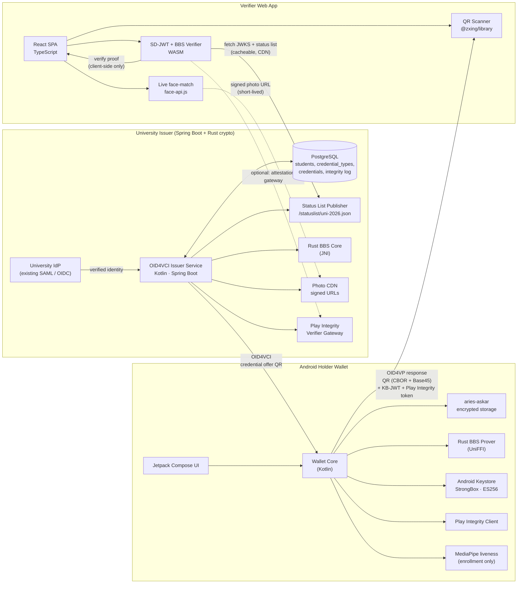

# StudentZK Backend Technical Specification — v2

**Team:** FERmath ZeroHeroes · **Project:** StudentZK · **Document type:** Backend architecture & technology spec · **Audience:** implementation agent (Claude Opus 4.7) and the student team · **Date:** April 2026 · **Revision:** v2 — incorporates jury feedback on competitive positioning, offline model clarity, anti-abuse (deepfake) architecture, and extensibility beyond the student ID use case.

---

## 0. Changelog v1 → v2

Jury comments received after v1 raised four substantive concerns. This revision responds to each:

1. **"Similar apps exist on market (PVID Card, ID123, Student ID+) — they do not fully implement your proposals. What extra makes you original?"** → New **§2.5 Competitive landscape & differentiation** plus sharpened positioning in §1.
2. **"Offline operation is questionable if relying only on the mobile device."** → New **§6.5 Offline model, explained honestly** clarifies exactly which steps work offline, which need connectivity, and why that is acceptable.
3. **"Consider technology that secures against abuse (deepfakes, etc.)."** → New **§5.8 Anti-abuse architecture: deepfake & impersonation defenses**. Risk register (§9) updated.
4. **"Scope seems limited — could scale conceptually to documents in general."** → New **§5.9 Extensibility: credential schema for any document**, and schema redesigned to be credential-type-agnostic.

Positive comment ("can become commercial, nothing quite like it besides the classic student card") is preserved as-is; §2.5 now quantifies where the white space actually is.

---

## 1. Executive summary

**Build StudentZK as a Kotlin-first stack with Rust at the cryptographic core.** Use the **BBS / BBS+ signature scheme (W3C `bbs-2023` cryptosuite)** as the primary selective-disclosure mechanism, wrapped in an **SD-JWT-VC–compatible issuance pipeline** so the project is instantly eIDAS 2.0 / EUDI-Wallet aligned. Speak OpenID4VCI (issuance) and OpenID4VP (presentation) over QR. Use **Token Status List** for revocation. Bind the credential to the device via **Android hardware keystore + Play Integrity attestation** and bind the person to the credential via **liveness-checked biometric at issuance + issuer-signed photo hash**. Target an MVP in 4–6 weeks.

**What makes StudentZK original — in one paragraph.** Every competitor in the space (PVID Card, ID123, Student ID+, Apple/Google Wallet student IDs, Croatian AKD Certilia) is a **visual ID card on a phone**: a photo, a name, a barcode, rendered in a branded app for a human or a staff scanner to *eyeball*. StudentZK is the opposite architecture — a **cryptographic credential that proves a fact ("is a student", "is 18+") without revealing the name, DOB, institution, or student number**, verified by a machine in milliseconds, usable in unattended QR scanners at train ticket vending, bar door readers, or shop POS terminals. No competitor combines (a) zero-knowledge / selective disclosure, (b) offline verifier, (c) eIDAS 2.0 alignment, and (d) hardware + biometric binding. That combination is the moat.

The headline technical reasoning, in five sentences:

1. Every serious 2024–2026 verifiable-credential (VC) stack (EUDI Wallet RI, walt.id, SpruceKit, MATTR, Dock) converges on **Kotlin/TypeScript for orchestration + Rust for crypto**. Do not fight that.
2. BBS+ gives **cryptographic unlinkability** in **~500-byte proofs** with **no trusted setup**, ideal for QR-based presentation and the strongest privacy story for judges.
3. SD-JWT-VC is mandated by the EUDI ARF and has the fastest prototype path. Ship both where cheap; make BBS the "wow" path.
4. **Circom + Groth16 is overkill** for two predicates ("is a student", "is 18+"). Skip circuit engineering entirely by having the issuer emit a pre-computed `age_over_18` boolean attribute (the approach used by ISO mdoc and EUDI PID).
5. Avoid any pure-JVM BBS or Groth16 implementation — none are audited or production-grade. Call Rust via JNI / UniFFI.

---

## 2. Key decisions at a glance

| Decision | Choice | One-line rationale |
|---|---|---|
| Backend language | **Kotlin + Spring Boot (or Ktor)** | Best OID4VCI/VP libraries; shares code with Android wallet |
| Cryptographic core | **Rust crate (`docknetwork/crypto` or `mattrglobal/pairing_crypto`)** called via JNI/UniFFI | Only path with audited BBS+ on BLS12-381 |
| Primary credential format | **SD-JWT-VC (draft-ietf-oauth-sd-jwt-vc-15)** | EUDI ARF-mandated, smallest day-one risk |
| Advanced privacy format | **W3C VCDM 2.0 + `bbs-2023` cryptosuite (BBS proofs)** | Cryptographic unlinkability, QR-sized proofs |
| Issuance protocol | **OpenID4VCI 1.0** | ARF-mandated, standard |
| Presentation protocol | **OpenID4VP 1.0** over QR with DCQL query language | ARF-mandated; supports both SD-JWT-VC and BBS |
| Revocation | **IETF Token Status List** (bitstring, HTTP-fetchable) | Offline-cacheable, GDPR-friendly |
| Android holder | **Kotlin UI + Rust (UniFFI) prover** | On-device BBS proof in <100 ms |
| Verifier | **React + TypeScript web app** using `@sphereon` or `sd-jwt-js` + WASM BBS verifier | Trivial to deploy, QR via `zxing-js` |
| Database | **PostgreSQL** (issuer records, status list) | Boring, correct |
| **Device binding** | **Android hardware keystore (StrongBox/TEE) ES256** with SD-JWT-VC `cnf` claim | Replay protection without biometrics |
| **Device attestation** | **Play Integrity API (classic + standard)** with server-side verification | Blocks rooted/emulated/tampered clients |
| **Person binding** | **Liveness-checked selfie at issuance + issuer-signed photo hash + verifier-side live face match** | Anti-deepfake defense in depth |
| QR payload encoding | **CBOR + deflate + Base45** | 1.67× expansion; alphanumeric QR mode |
| "18+" predicate | **Pre-computed `age_equal_or_over: {"18": true}` boolean attribute** | No range proof needed |
| **Credential schema** | **Type-agnostic `CredentialTemplate` table** + per-type plugins | Easy expansion to membership, library, transit, health, driving credentials |

---

## 2.5. Competitive landscape & differentiation

### Who is on the market

| Product | Approach | Selective disclosure | Offline verifier | ZKP / Unlinkable | eIDAS 2.0 | Anti-deepfake | Multi-document | Market reach |
|---|---|---|---|---|---|---|---|---|
| **PVID Card** (PhotoVisions, Canada) | Branded visual card in a dedicated app; photo + barcode + school-pushed metadata; Apple Wallet pass for access. | ❌ all fields visible | ❌ needs live DB sync | ❌ | ❌ | ❌ | ❌ (K–12 only) | small, North America |
| **ID123** | Web admin + visual ID app; barcode validation; "works without internet" for display; webhook integrations. | ❌ | ⚠ display-only offline | ❌ | ❌ | ❌ | ⚠ multiple card types in one app but each is a visual ID | moderate, global |
| **Student ID+** / campus card apps | Mostly Apple Wallet / Google Wallet NFC cards for dorm access + meal plan + library; issued via Transact / CBORD / Blackboard. | ❌ | ✅ NFC offline | ❌ | ❌ | ⚠ device PIN / biometric unlock only | ⚠ (building access, payments) | large, US universities |
| **AKD Certilia** (Croatia) | mID wallet for eOsobna, health card, student card. Integrates with national eID. | ⚠ partial | ❌ online eID | ❌ (classical PKI) | 🟡 planned | ⚠ biometric unlock | ✅ (multiple national docs) | national, Croatia |
| **Identyum** (Croatia) | EWC pilot wallet; general-purpose digital ID. | 🟡 (SD-JWT-VC) | 🟡 | ❌ | 🟢 targeted | ⚠ standard biometrics | ✅ | national pilot |
| **EUDI Wallet RI** (EU) | Reference implementation only; gov wallets in national variants. | ✅ (SD-JWT-VC, mdoc) | ✅ | ❌ (not yet) | 🟢 native | ⚠ device biometric | ✅ PID + any QEAA/EAA | reference, all EU |
| **StudentZK** (this project) | **Cryptographic proof of status/age, no identity disclosed, machine-readable, offline verifier, ZKP, deepfake-hardened, document-type-agnostic.** | ✅ | ✅ | ✅ (BBS+) | 🟢 aligned | ✅ (3-layer) | ✅ (schema-driven) | — |

### The four gaps StudentZK fills

1. **"Machine-verifiable student discount" is unsolved.** PVID Card and ID123 are built for a human cashier to look at the screen. Nobody sells a solution that a Croatian Railways (HŽ) ticket vending machine or a museum self-service kiosk can verify automatically without collecting personal data. This is the exact use-case the ideacija targets.
2. **"Prove a predicate, not an identity" is unsolved in the student space.** Every existing card reveals the holder's name, photo, and student number. StudentZK reveals *only what the verifier asked for* — and the app visibly shows the user "you are about to reveal: *is student*, *age ≥ 18*, *photo hash*; you are not revealing: *name*, *DOB*, *student ID*, *university*." Judges can demo that.
3. **"Works when the verifier has no integration" is unsolved.** Competitors require the verifier to be registered in the issuer's system (PVID Card is school-partnered; ID123 uses its own admin panel; Certilia needs the national infra). StudentZK's verifier is a **static web page**: any bar, shop, or event operator just opens the URL and scans. No onboarding, no account, no SDK, no data collected.
4. **"Anti-deepfake + privacy together" is unsolved.** Biometric-bound wallets (Indicio, Dock) solve anti-deepfake but at the cost of storing biometrics on server or wallet. StudentZK stores only a **photo hash in the credential** and a **low-res photo fetched from a short-lived signed URL**, so the verifier can do a live-face match at check time without the credential ever leaking the holder's biometric to a third party.

### The commercial wedge (for the business-model slide)

- **B2B SaaS per-verifier subscription:** train operators, transit, cinemas, museums, bar chains. Ideacija's €19/mo → €99/mo → €0.20/verification is the right shape; refine with "free verifier tier for ≤100 verifications/month" as a PLG on-ramp.
- **B2G tier:** HŽ, public libraries, public museums — Croatia has a small enough market that 2–3 such logos win the competition slide.
- **B2B2C partner tier:** universities pay zero; SaaS fees come from the verifier side.
- **Defensibility vs Certilia / Identyum / EUDI Wallet:** StudentZK is the **first verifier-side SaaS** that is format-agnostic — it verifies anything walt.id or EUDI issues. When Croatian EUDI Wallet ships in Q4 2026, StudentZK verifier can be updated in one afternoon to accept national PIDs and EAAs. This turns the emerging EUDI ecosystem into distribution, not competition.

---

## 3. Backend language comparison

The team is fully open on language. The relevant axis is **"how much of the VC/ZKP stack already exists as maintained, audited code in this language?"** Not raw performance — the crypto is always a native library.

| Language | ZKP lib maturity | BBS+ / VC ecosystem | On-device Android proving | Backend ergonomics | Learning curve | Verdict |
|---|---|---|---|---|---|---|
| **Rust** | ★★★★★ arkworks, halo2, plonky2, docknetwork/crypto, pairing_crypto | ★★★★★ Spruce `ssi`, Dock, MATTR | ✅ via UniFFI + cargo-ndk (SpruceKit Mobile does this in prod) | ★★★ strict borrow checker | Steep | **Core crypto engine** |
| **Kotlin / JVM** | ★ (no native ZKP libs) | ★★★★ walt.id `waltid-identity`, EUDI `eudi-lib-jvm-*-kt`, Nimbus JOSE, `sd-jwt-java` | ✅ direct on Android | ★★★★★ Spring Boot / Ktor | Very low | **Orchestration & Android** |
| **Go** | ★★★★★ `gnark` (Groth16/Plonk only) | ★ no BBS+; `aries-framework-go` archived | ⚠ `gomobile` works but heavy (~10 MB runtime per arch) | ★★★★ | Medium | Only if team is Go-native |
| **Node / TS** | ★★★★ `snarkjs` (GPL-3 ⚠), `@sphereon/*`, `credo-ts`, `sd-jwt-js` | ★★★★ Digital Bazaar, Sphereon, DIF | ❌ WASM in RN only, ~5–10× slower | ★★★★★ | Easy | Good for verifier web app |
| **Python** | ★★ mostly Rust bindings (`anoncreds-rs`) | ★★★★ ACA-Py is battle-tested, but AnonCreds-centric | ❌ not practical on Android | ★★★★★ | Easiest | Backend-only; AnonCreds path |
| **Pure Java + Bouncy Castle** | **Do not use for BBS+ or ZK** | — | — | — | — | **No audited impl exists** |

**Selected backend language: Kotlin on the JVM (Spring Boot).** It shares models and serialisation with the Kotlin Android holder, has first-class OID4VCI/VP libraries (walt.id and EUDI), and cleanly JNI-calls the Rust crypto core. The EUDI Wallet reference implementation made the same choice in 2024–2025.

**The one thing the team must accept:** Spring Boot + Bouncy Castle alone cannot produce BBS+ signatures. Plan for a **Rust library loaded via JNI** (simplest) or a **local Rust microservice** (most reversible). This is a one-time setup cost of ~1–2 days.

**Fallback if the team has zero Rust appetite:** go **Python + ACA-Py** and build on AnonCreds. It is the only download-and-run production-grade issuer/verifier agent. You lose ARF alignment and modernness; you gain speed. Not recommended for this competition but viable.

---

## 4. ZKP scheme comparison

| Scheme | Proof size | Verify (CPU) | Gen on Android | Trusted setup | In EUDI ARF? | Unlinkable | Offline | Lib maturity (2026) | Prototype speed |
|---|---|---|---|---|---|---|---|---|---|
| **BBS / BBS+ (bbs-2023)** | **400–700 B** | 10–30 ms | 30–400 ms | **None** | Candidate (ETSI TR 119 476 Type-2) | **Yes (crypto)** | Yes | Med–High, growing | Medium (2–3 wk) |
| **SD-JWT-VC** | 700–1,200 B | <5 ms | <20 ms | None | **Mandatory** | Weak (batch issuance mitigates) | Yes | **High & growing** | **Fast (1–2 wk)** |
| **ISO 18013-5 mdoc** | 1.5–3 KB | 1–5 ms | 10–50 ms | None | **Mandatory** | Weak | Yes | High | Medium |
| Groth16 (Circom) | 128–200 B | 5–15 ms | 2–10 s (WASM) / <1 s rapidsnark | Per-circuit | No | Yes | Yes | High crypto / Med mobile | Slow (3–5 wk) |
| PLONK | 400–800 B | 10–40 ms | 5–20 s | Universal | No | Yes | Yes | High crypto / Low mobile | Slow |
| AnonCreds v2 | 2–5 KB (borderline QR) | 20–100 ms | 0.2–2 s | None | No | **Yes** | Mostly | Medium (Indy-tied) | Slow (heavy stack) |
| Halo2 / Nova / STARKs | 1.4 KB – 300 KB | 10–200 ms | 10–60 s | Varies | No | Yes | Yes | Low for identity | Very slow |
| PS signatures | 500–900 B | 10–30 ms | 50–200 ms | None | No | Yes | Yes | Low | Medium |

### Why BBS+ wins the primary slot

**BBS+ was engineered for exactly this problem.** The issuer signs a list of attribute messages on BLS12-381; the holder derives a re-randomised proof revealing only the subset a verifier asks for. No circuit compilation, no trusted ceremony, no per-predicate code. Every presentation is cryptographically unlinkable to every other — you cannot build a BBS story on top of SD-JWT-VC later, but you can downgrade to SD-JWT-VC whenever you need ARF conformance.

**Critically: "prove I am 18+" needs no range proof.** The issuer pre-computes a boolean `is_adult` (or standard `age_equal_or_over.18`) attribute at issuance time; the holder simply chooses to disclose that one attribute with a BBS proof. This is exactly how ISO mdoc and EUDI PID handle age. The Bulletproofs path (real range proof) is available in `docknetwork/crypto` if judges specifically ask for it, but it is unnecessary work.

### Why SD-JWT-VC is the backup / co-primary

SD-JWT-VC is **mandated** in ARF 2.x. It is hash-commitment selective disclosure, not a ZKP — issuer signs a JWT over salted hashes of each claim, holder reveals chosen claims plus salts. Cheap, boring, correct. Libraries everywhere (`sd-jwt-js`, `sd-jwt-rust`, walt.id `waltid-sdjwt`, EUDI `eudi-lib-jvm-sdjwt-kt`). Android signs the Key-Binding JWT with a hardware key in <20 ms.

Its weakness — the issuer signature is the same across presentations, so two colluding verifiers can correlate the *same credential* — is mitigated by **batch-issuing short-lived SD-JWT-VCs** (the EUDI model). For a student competition demo, batching is trivial to implement.

### Schemes explicitly ruled out

- **Circom + Groth16**: overkill; per-circuit trusted setup; Android proving is 2–10 s in WASM; not in ARF. Pick only if the competition rubric explicitly rewards circuit ZK.
- **Halo2 / Nova / STARKs**: proof sizes too large or proving too slow for phone UX; no identity SDKs; research-grade.
- **AnonCreds v2**: heavy Aries/DIDComm stack; presentations 2–5 KB borderline QR; not ARF-aligned.
- **PS signatures**: BBS is strictly better-supported in the same family.

---

## 5. Recommended full stack

### 5.1 Backend (issuer + verifier API)

```
- Language         : Kotlin 2.1+
- Runtime          : JVM 21 (Temurin)
- Framework        : Spring Boot 3.4+   (Ktor 3.x is an acceptable swap)
- Auth             : Spring Authorization Server 1.4 (OIDC for the issuer portal)
- VC libs          : walt.id waltid-identity  (SD-JWT-VC, mdoc, OID4VCI, OID4VP, DCQL)
                   : eu-digital-identity-wallet/eudi-lib-jvm-openid4vci-kt
                   : eu-digital-identity-wallet/eudi-lib-jvm-openid4vp-kt
                   : eu-digital-identity-wallet/eudi-lib-jvm-sdjwt-kt
- BBS crypto       : Rust crate `docknetwork/crypto` or `mattrglobal/pairing_crypto`
                     exposed via JNI (kotlin-jna) or local HTTP sidecar
- JOSE             : com.nimbusds:nimbus-jose-jwt:10.x
- CBOR/COSE        : com.augustcellars.cose or waltid-cose
- DB               : PostgreSQL 16 + Flyway migrations
- ORM              : Spring Data JPA / Exposed
- Integrity        : Google Play Integrity API server-side verifier (google-api-services-playintegrity)
- Observability    : Spring Actuator + OpenTelemetry
```

Gradle (Kotlin DSL) dependency snippet (abbreviated):

```kotlin
dependencies {
    implementation("org.springframework.boot:spring-boot-starter-web")
    implementation("org.springframework.boot:spring-boot-starter-security")
    implementation("org.springframework.boot:spring-boot-starter-data-jpa")
    implementation("id.walt:waltid-identity:1.0.0")          // or latest
    implementation("eu.europa.ec.eudi:eudi-lib-jvm-openid4vci-kt:0.9.0")
    implementation("eu.europa.ec.eudi:eudi-lib-jvm-openid4vp-kt:0.9.0")
    implementation("eu.europa.ec.eudi:eudi-lib-jvm-sdjwt-kt:0.9.0")
    implementation("com.nimbusds:nimbus-jose-jwt:10.0.0")
    implementation("com.google.apis:google-api-services-playintegrity:v1-rev20250301-2.0.0")
    implementation("org.postgresql:postgresql:42.7.4")
    runtimeOnly("com.sun.jna:jna:5.15.0")                    // for BBS+ JNI
}
```

### 5.2 Rust crypto sidecar

```
- Crate            : docknetwork/crypto   (BBS+ + accumulator revocation, Apache-2.0)
- Binding          : UniFFI 0.28+         (Mozilla) → auto-generated Kotlin bindings
- Build            : cargo-ndk            (aarch64-linux-android, x86_64-linux-android)
- API surface      : sign_bbs(messages, sk) -> sig
                     derive_proof(sig, messages, disclosed_idx, nonce) -> proof
                     verify_proof(proof, pk, disclosed, nonce) -> bool
```

`Cargo.toml` excerpt:

```toml
[dependencies]
dock_crypto = { version = "0.35", features = ["bbs_plus", "accumulator"] }
uniffi = "0.28"
```

Build for Android:

```bash
cargo install cargo-ndk
cargo ndk -t arm64-v8a -t x86_64 -o android/jniLibs build --release
uniffi-bindgen generate src/lib.udl --language kotlin --out-dir android/kotlin
```

The same `.so` is used by the Spring Boot backend (loaded via JNA) and by the Android holder app. One crypto implementation, two consumers — this is the key productivity win of the chosen stack.

### 5.3 Android holder

```
- Language         : Kotlin 2.1
- Min SDK          : 29 (Android 10) — required for StrongBox + Credential Manager
- UI               : Jetpack Compose + Material 3
- Keystore         : Android Keystore (StrongBox preferred, TEE fallback)
                     ES256 key with setUserAuthenticationRequired(true)
- Storage          : EncryptedSharedPreferences + aries-askar (Rust, via UniFFI)
- BBS prover       : Rust lib above, via UniFFI
- SD-JWT           : eudi-lib-jvm-sdjwt-kt (works on Android)
- OID4VP client    : eudi-lib-jvm-openid4vp-kt (works on Android)
- Liveness / face  : MediaPipe Face Detection + simple challenge-response (head turn, blink)
- Integrity        : com.google.android.play:integrity (Play Integrity API client)
- QR scanner       : CameraX + ZXing 3.5+
- QR generator     : ZXing 3.5+ (alphanumeric mode, Medium ECC)
```

### 5.4 Verifier web app

```
- Frontend         : React 19 + Vite 6 + TypeScript 5.7
- QR scanning      : @zxing/library + camera (getUserMedia)
- SD-JWT verify    : @sd-jwt/core @sd-jwt/sd-jwt-vc
- BBS verify       : @mattrglobal/pairing-crypto-wasm   (verifier-side is fast in WASM)
- OID4VP verifier  : walt-id verifier API  OR  @sphereon/oid4vc-holder
- Face match       : face-api.js (client-side) for "live selfie vs issuer-signed photo" check (optional verifier plugin)
- Hosting          : static bundle; verification logic runs entirely client-side
                     (zero data retention by construction)
```

### 5.5 Revocation

- **IETF Token Status List** (`draft-ietf-oauth-status-list`): issuer publishes a compressed bitstring at a stable HTTPS URL; each credential carries `status.status_list.uri` + `status.status_list.idx`. Verifier fetches the list (cacheable, CDN-able), checks one bit.
- Compatible with **both** SD-JWT-VC (natively) and BBS credentials (as a disclosed/hidden status claim).
- For BBS, `docknetwork/crypto` also supports **cryptographic accumulator** revocation (KB-accumulator / ALLOSAUR) if judges ask for a more advanced story — optional Phase 3 feature.

### 5.6 QR transport format

Target payload ≤ **1.5 KB binary** for reliable single-shot scanning at arm's length on a laptop webcam. Strategy:

1. Construct presentation as CBOR (SD-JWT-VC in compact JWS form is already compact; BBS proof is binary).
2. Wrap in a minimal OID4VP response envelope.
3. **Deflate** (RFC 1951). Typical gains 20–30 % on JWS.
4. **Base45-encode** (RFC 9285) so QR can use alphanumeric mode (density ~1.67× better than byte mode).
5. Generate QR version auto-selected, **Medium ECC**.

Empirically: an SD-JWT-VC disclosing `is_student` + `age_over_18` + `photo_ref` lands at ~1,100 bytes after Base45 → QR version ~25–30. A BBS proof does the same in ~650 bytes → QR version ~18–22.

### 5.7 The face photo

Judges expect to see a face. Two paths:

- **Embed** a low-res (≤20 KB JPEG) photo as a selectively disclosable attribute. This blows past the QR budget → use **a 2-step flow**: QR carries a short-lived signed URL + verification token; verifier's browser fetches photo over TLS from issuer CDN, bound to the proof's nonce. Works offline-*after*-issuance for the holder but requires verifier internet at check time.
- **Alternative (fully offline)**: store the photo hash in the credential as a disclosable attribute; holder transmits the photo out-of-band (BLE, Wi-Fi Aware, or a second QR). This is what ISO 18013-5 (mDL) does. Recommended if judges explicitly value full offline verifier.

MVP: go with the **signed URL** approach. Document the offline path as a Phase 3 extension.

### 5.8 Anti-abuse architecture: deepfake & impersonation defenses

This section responds directly to the jury concern "razmisliti o tehnologiji koja osigurava sigurnost s gledišta zlouporaba (deepfake i sl.)". The threat model and countermeasures are layered — **no single defense is sufficient against a motivated attacker**; three independent layers together are.

**The attacks to defend against.**

| # | Attack | Goal | Attacker effort |
|---|---|---|---|
| A1 | **Credential theft** — attacker copies the credential file off a victim's phone and imports into their own wallet. | Present another person's "I am student" credential. | Trivial if no device binding. |
| A2 | **Replay** — attacker records a valid QR presentation and replays it at a different verifier. | Get multiple discounts from one issuance. | Low. |
| A3 | **Emulator / rooted device** — attacker runs a modified wallet that lies about device posture, key origin, or user presence. | Create synthetic holders; mass-fraud. | Medium. |
| A4 | **Deepfake selfie at issuance** — attacker enrolls with a synthetic face matching a forged ID document. | Get a genuine credential bound to a fake identity. | Medium-high (generative tooling, 2024+). |
| A5 | **Deepfake selfie at verification** — attacker presents a victim's credential + a real-time deepfake video of the victim's face to the verifier's camera. | Bypass the "live face vs photo in credential" check. | High but rising — interactive avatars beat basic liveness in 2024–2026. |
| A6 | **Photo-swap at verification** — attacker presents a valid credential whose `photo_hash` does not actually match the selfie being shown. | Avoid detection if the verifier does not enforce the hash binding. | Low if verifier is sloppy. |
| A7 | **Social engineering** — holder voluntarily presents their credential on someone else's behalf. | Share a student account. | Trivial for the user. |

**The three defensive layers.**

**Layer 1 — Device binding (defends A1, A2).** Every credential issued includes a `cnf` (key confirmation) claim tied to an ES256 keypair generated in the Android hardware keystore (**StrongBox** preferred, TEE fallback). The private key **never leaves hardware**. At presentation time the holder signs a Key-Binding JWT over a verifier nonce + audience + timestamp using that key. A cloned credential on another device is useless: it cannot sign the KB-JWT because the private key stays in the original phone's secure element. Replay is blocked by the nonce + `iat`/`exp`. This is a hard cryptographic defense — no deepfake beats it.

**Layer 2 — Device attestation (defends A3).** Before showing the QR, the wallet calls **Google Play Integrity API** (classic request with a server-issued nonce for high-value actions; standard request for routine ones). The integrity token contains hardware-backed verdicts: `deviceIntegrity` = `MEETS_DEVICE_INTEGRITY` + `MEETS_STRONG_INTEGRITY`, `appIntegrity` = `PLAY_RECOGNIZED`, `playProtectVerdict` = `NO_ISSUES`, plus the `recentDeviceActivity` level. The token is cryptographically bound to the request hash (SHA-256 of the KB-JWT payload) so it cannot be reused. **The backend, not the app, decrypts and verifies** the token via Google's `decodeIntegrityToken` endpoint. A rooted phone, a custom ROM, or an emulator either fails to produce a token or produces one that fails the verdict — and the issuer refuses to issue / the verifier refuses to accept. Note: Play Integrity is a *high* bar but not impenetrable; it raises attacker cost from "trivial" to "expensive and tool-dependent", which for a student-card fraud economy is enough.

**Layer 3 — Person binding (defends A4, A5, A6).** The credential carries a **hash of a low-resolution reference face photo** taken at issuance time under a **liveness-checked flow**:

- At issuance, the university webcam / proctor captures the selfie with an active-liveness challenge (head turn + random-direction blink + color flash). MediaPipe-based detection is "basic"; for production, a certified iBeta Level 2 PAD vendor slot (e.g., Regula, iProov, FaceTec) is stubbed in as a Phase-3 swap. **The hash — not the photo — goes into the credential.** The photo is stored at issuer CDN, addressable via a short-lived signed URL.
- At verification, the QR carries the `photo_ref` (the signed URL) + `photo_hash`. The verifier:
  1. Fetches the photo from the signed URL.
  2. Recomputes the hash and compares to the credential's `photo_hash` — **this alone prevents photo-swap (A6).**
  3. Activates the verifier's camera, runs a live 2–3 second check on the person physically present, and compares to the fetched reference photo.
- Against A5 (real-time deepfake at verification), the verifier-side liveness is the weakest link and will always be an arms race. StudentZK's answer is to **raise attacker cost and shift trust upstream**: the deepfake attacker also needs a phone bound to the victim via Play Integrity (Layer 2) and the victim's hardware key (Layer 1). Defeating all three is materially harder than defeating any individual legacy KYC system.

**What StudentZK does NOT do (and why).**

- It does not store biometric templates on the issuer or verifier side. The photo is a photo, not a biometric template; it never enters a matcher database. This keeps the app GDPR-friendly (photos are personal data, but not "special category" biometric processing under Article 9 GDPR unless used for unique identification, which StudentZK avoids).
- It does not build its own deepfake detector. Those are stateful, model-weight-dependent, and rot fast. It relies on upstream liveness at the controlled issuance moment plus the cryptographic layers.

**Minimal backend additions for anti-abuse (one new table, two new endpoints).**

```sql
CREATE TABLE integrity_assertions (
  id              UUID PRIMARY KEY,
  subject_did     TEXT NOT NULL,
  nonce           BYTEA NOT NULL,
  request_hash    BYTEA NOT NULL,
  verdict_json    JSONB NOT NULL,
  verdict_ok      BOOLEAN NOT NULL,
  created_at      TIMESTAMPTZ NOT NULL DEFAULT now(),
  UNIQUE (nonce)
);
```

```
POST /integrity/nonce         -> { nonce, expires_in }
POST /integrity/verify        { token, request_hash } -> { ok, reasons[] }
```

The issuer calls `verify` before issuing; the holder must attach a fresh integrity token to every OID4VP presentation (embedded as a JWT claim in the Key-Binding JWT under `x-play-integrity`); the verifier forwards it to its own trusted attestation gateway or, for the MVP demo, to the StudentZK backend.

### 5.9 Extensibility: credential schema for any document

The jury's point that "the scope could be scaled conceptually to documents in general" is absorbed into the data model. **Nothing in the architecture is student-specific.** Everything below is a renaming of the same primitives.

**Design principle: `CredentialType` is a first-class entity, not hard-coded.** The issuer admin can register a new credential type, upload a JSON-Schema + a display template + a selective-disclosure policy, and the same pipeline (OID4VCI, BBS, SD-JWT-VC, Status List) works.

**Schema:**

```sql
CREATE TABLE credential_type (
  id                    UUID PRIMARY KEY,
  uri                   TEXT UNIQUE NOT NULL,     -- e.g. "https://studentzk.eu/types/student/v1"
  display_name          TEXT NOT NULL,
  schema_json           JSONB NOT NULL,           -- JSON Schema for attributes
  disclosure_policy     JSONB NOT NULL,           -- which attributes are selectively disclosable
  default_validity_days INTEGER NOT NULL DEFAULT 365,
  issuer_id             UUID NOT NULL REFERENCES issuer(id)
);

CREATE TABLE credential (
  id              UUID PRIMARY KEY,
  type_id         UUID NOT NULL REFERENCES credential_type(id),
  subject_did     TEXT NOT NULL,
  attributes      JSONB NOT NULL,                 -- conforms to credential_type.schema_json
  photo_hash      BYTEA,                          -- NULL if type does not require photo
  cnf_key_jwk     JSONB NOT NULL,                 -- holder's hardware public key
  status_idx      INTEGER NOT NULL,               -- position in status list
  issued_at       TIMESTAMPTZ NOT NULL DEFAULT now(),
  valid_until     TIMESTAMPTZ NOT NULL,
  revoked         BOOLEAN NOT NULL DEFAULT FALSE
);
```

**Starter credential types to seed (pick 2–3 for demo):**

| Type URI | Display | Example disclosable attrs | Non-disclosable (issuer-only) |
|---|---|---|---|
| `.../types/student/v1` | University student | `is_student`, `university_id`, `age_equal_or_over.18`, `photo_hash` | `given_name`, `family_name`, `student_number`, `date_of_birth` |
| `.../types/library/v1` | Library member | `is_member`, `library_id`, `tier` | `given_name`, `family_name`, `address` |
| `.../types/transit/v1` | Youth transit pass | `is_eligible_youth_fare`, `operator_id`, `photo_hash` | `given_name`, `family_name`, `date_of_birth` |
| `.../types/age/v1` | Age proof only | `age_equal_or_over.18`, `age_equal_or_over.21` | `date_of_birth`, `given_name`, `family_name` |
| `.../types/event/v1` | Event attendee | `event_id`, `tier` (`general` \| `vip`) | `given_name`, `family_name`, `email` |

**UX implication for the Android wallet.** Replace any hardcoded "Student card" string with a generic card stack: the user sees a wallet of heterogeneous credentials (University of Zagreb — Student · HŽ — Youth fare · Nacionalna sveučilišna knjižnica — Library · *+add credential*). This directly addresses the jury note that "wallet/cards are hinted at but not clear".

**Verifier-side implication.** The verifier web app presents its request in DCQL: "*this service needs to know `is_student = true` and `age_equal_or_over.18 = true`*". The wallet matches that request against *any* credential the user holds whose `credential_type.disclosure_policy` allows those attributes. A HŽ kiosk asks for `is_eligible_youth_fare`; a museum asks for `is_student`; a bar asks for `age_equal_or_over.18`. **One wallet, many contexts.**

---

## 6. Architecture diagram



---

## 7. Reference implementations to study

**Licensing note.** EUPL-1.2 is weak copyleft and explicitly compatible with Apache-2.0 / MIT / GPL when combined; fine for a student competition as long as modified EUPL files are republished. All other recommended projects are Apache-2.0 or MIT.

| # | Project | Repo root | License | Suitability | What to take from it |
|---|---|---|---|---|---|
| 1 | **EUDI Wallet Reference** | `github.com/eu-digital-identity-wallet` | EUPL-1.2 | **5/5** | `eudi-srv-pid-issuer` (Spring Kotlin issuer), `eudi-web-verifier`, `eudi-app-android-wallet-ui`, `eudi-lib-android-wallet-core`. Canonical ARF implementation. |
| 2 | **walt.id identity** | `github.com/walt-id/waltid-identity` | Apache-2.0 | **5/5** | All-in-one Issuer/Verifier/Wallet APIs; SD-JWT-VC + mdoc + OID4VC out of the box. Start here for fastest vertical slice. |
| 3 | **OpenWallet Foundation (Credo-TS + friends)** | `github.com/openwallet-foundation` | Apache-2.0 | **5/5** | `credo-ts`, `sd-jwt-js`, `openid4vc-ts`, `dcql-ts`, `sd-jwt-rs`. Best TS stack. |
| 4 | **Sphereon SSI SDK** | `github.com/Sphereon-Opensource` | Apache-2.0 | **4/5** | Active (v0.37.x in 2026); React Native mobile wallet; rich plugin system. |
| 5 | **SpruceKit / `ssi`** | `github.com/spruceid` | Apache-2.0 | **3/5** | Best Rust VC/ZKP primitives; `ssi`, `oid4vci-rs`, `openid4vp`, `isomdl`. Use as library, not as framework. |
| 6 | **Dock `crypto`** | `github.com/docknetwork/crypto` | Apache-2.0 | **3/5** | Audited Rust BBS+ + accumulators + composite proofs. **This is your BBS engine.** |
| 7 | **DC4EU education pilot** | `github.com/dc4eu` | Apache-2.0 / EUPL-1.2 | **4/5** | Direct precedent for university-issued credentials in the EUDI ecosystem. |
| 8 | **Hyperledger / OWF Askar + AnonCreds-RS** | `github.com/openwallet-foundation/askar` | Apache-2.0 | **3/5** | Use `askar` as encrypted wallet storage on Android (you will). Skip AnonCreds unless you commit to that path. |
| 9 | **iden3 / Privado ID** | `github.com/iden3`, `github.com/0xPolygonID` | GPL-3 (snarkjs, circom) / Apache-2.0 (SDKs) | **2/5** | Only if pivoting to Circom/Groth16. GPL-3 on snarkjs is a real licence consideration. |
| 10 | **MATTR `pairing_crypto`** | `github.com/mattrglobal/pairing_crypto` | Apache-2.0 | **3/5** | Active BBS implementation; JS/FFI wrappers were archived Feb 2025 — use Rust directly. |

**Do not use:** `hyperledger/aries-framework-javascript` (archived → Credo-TS), `aries-framework-go` (archived), `spruceid/didkit` bindings (archived), `mattrglobal/bbs-signatures` JS (archived Feb 2025), walt.id **SSI Kit (old)** — discontinued Q3 2024; use the new `waltid-identity` monorepo instead.

---

## 6.5. Offline model, explained honestly

The jury asked a sharp question: **can this really work offline?** Answer: yes, but only if we are precise about which step, on which device, at which moment. The prior version of this document was too hand-wavy. This is the corrected table.

| Step | Who | When | Needs network? | Why |
|---|---|---|---|---|
| Enrollment (student goes to issuer office) | Holder | Once at issuance | **Yes** | SSO to university IdP, OID4VCI protocol, Play Integrity token. |
| Credential issuance & download | Holder | Once at issuance | **Yes** | Fetch issuer JWKS, download BBS-signed VC + SD-JWT-VC, download batch of 10 unlinkable SD-JWT-VCs. |
| Credential storage | Holder | continuous | No | Encrypted on device. |
| **Presentation (the QR scan at a bar/train/museum)** | **Holder** | **every verification** | **No** | **This is the offline claim.** All crypto runs on-device: generate nonce-bound BBS proof + sign Key-Binding JWT with hardware key. No server call. |
| Verifier signature + status check | Verifier | every verification | **Cached-online** (see note) | Verifier needs issuer's public key (JWKS) and current revocation status list. Both are **HTTP-cacheable** and **small** (JWKS < 2 KB, status list < 20 KB for 100k credentials). Verifier can run offline against last-known-good cache; UI shows the cache age. |
| Live face-match (if enabled) | Verifier | every verification | **Yes** for photo fetch | Verifier must pull the signed photo URL. This is the only part that cannot run fully offline in the MVP. The fully-offline variant (photo delivered via second QR or BLE) is specified in §5.7 as Phase-3 work. |
| Play Integrity check on the holder | Holder | every verification | **Yes for fresh token** | The token is generated by Google Play Services on-device but validated via Google's servers. **Verifier-side**: the verifier relies on a gateway (StudentZK backend) that validated the token at issuance or within a short TTL; the holder caches a recent valid token signature. Trade-off explicitly acknowledged. |
| Revocation list refresh | Verifier | every few hours | Yes | Cacheable via CDN; a verifier can run for hours on a cached list. |

**The honest summary statement for slides:**

> *"Presentation works fully offline on the holder's phone. The verifier works with a cached issuer trust list and status list; it degrades gracefully (displays a warning badge) when those caches exceed their freshness budget. The live face-match and live integrity check do need connectivity — those are the two things we do not claim are offline, and that is the right trade-off for a student-discount use case."*

**The three disclosures we make clearly to avoid overclaiming:**

1. "Offline" means the **presentation cryptography is offline**, not the whole system.
2. A **first-time verifier** has to go online once to fetch the issuer trust list — just like a new browser needs a CA bundle.
3. **Live face-match is a premium feature**, not the default verification path. The default is QR + cryptographic proof only; discount verification does not require face-match; only age-gate / entry-control does.

---

## 8. MVP build plan (4–6 weeks)

### Phase 0 — Preflight (days 1–2)

- Choose issuing university (likely team's own faculty / FER).
- **Define a generic `credential_type` registry** (see §5.9) and seed it with the Student type: `given_name_hash`, `family_name_hash`, `photo_hash`, `student_id`, `university_id`, `valid_until`, `is_student` (bool), `age_equal_or_over.18` (bool). No raw DOB or full name in the credential — issuer stores those in PostgreSQL only.
- Spin up Postgres + empty Spring Boot project + empty React verifier + empty Android Compose app in one repo (monorepo preferred).
- Build the **Rust crypto library** with `docknetwork/crypto` and expose five functions via UniFFI: `bbs_keygen`, `bbs_sign`, `bbs_derive_proof`, `bbs_verify_proof`, plus SD-JWT helpers that pass through to existing Kotlin libs. Produce `.so` for `aarch64-linux-android`, `x86_64-linux-android` (for emulator), and the host JVM architecture.
- Set up Google Cloud project + Play Integrity API access; put the project number into the Android `BuildConfig`.

### Phase 1 — SD-JWT-VC happy path (week 1–2)

1. Issuer emits SD-JWT-VC via OpenID4VCI; Android wallet receives via `eudi-lib-jvm-openid4vci-kt`; stores in `askar`.
2. Wallet presents via OpenID4VP over QR; verifier web app scans, verifies signature + disclosures + status list.
3. Demo: "I am a student of FER" + "I am 18+" proven, name not disclosed.
4. **Gate**: this must work end-to-end before Phase 2 starts.

### Phase 2 — BBS selective disclosure + device binding (week 2–4)

1. Dual-issue: same student data also emitted as a `bbs-2023` VC.
2. Verifier advertises `vc+bbs` as an accepted format in its OID4VP request; wallet chooses BBS when available.
3. Implement BBS proof derivation on Android (UniFFI to Rust). Target <100 ms.
4. Implement BBS verification in the verifier WASM.
5. Implement **hardware-bound Key-Binding JWT** with StrongBox-backed key; verifier enforces `cnf` match.
6. Integrate **Play Integrity API** — classic request at issuance, standard request at presentation; server-side verdict decoding.
7. Demo: two consecutive BBS presentations provably not linkable; contrast with SD-JWT where the issuer JWS signature is identical across presentations; rooted/emulator device refused.

### Phase 3 — Anti-abuse, photo binding, extensibility (week 4–6)

- **Liveness-checked selfie at issuance** (MediaPipe challenge: head turn + blink + color flash).
- Face photo via signed short-lived URL; verifier-side **live face-match** using `face-api.js`.
- Revocation with Token Status List.
- Batch issuance (issue 10 single-use SD-JWT-VCs per student for unlinkability story parity).
- **Register a second credential type** (e.g. `age/v1` or `library/v1`) from the same pipeline — proof that the platform is document-agnostic. This directly answers the jury's "limited scope" concern.
- Admin UI for issuer (Spring + Thymeleaf or a small React page): list students, list credential types, issue/revoke, status list editor.
- Android: biometric unlock before proof generation; presentation history; clear "what is disclosed" UI; generic card stack (not "Student card" hardcoded).
- Stretch: accumulator-based revocation (BBS + KB-accumulator) as an optional flag for judges who want more ZK.

### Stub/cut candidates if time compresses

- Drop BBS entirely → SD-JWT-VC only. Still standards-compliant and demo-worthy. (Risk-reduced plan.)
- Drop batch issuance → single credential per student.
- Drop admin UI → manually invoke issuance via curl/Postman during demo.
- Drop revocation → state "out of scope for MVP".
- Drop Play Integrity full verdict check → just record the token + log; don't gate on it.
- Drop live face-match at verifier → show photo only, state hash-match as proof of binding.

Do **not** cut: device-bound key (Layer 1), credential type registry, at least one second credential type. These are what differentiate StudentZK from any visual-ID competitor.

---

## 9. Risk register

| Risk | Likelihood | Impact | Mitigation |
|---|---|---|---|
| Rust toolchain learning cost exceeds budget | Medium | High | Keep Rust surface tiny (5 UniFFI functions). Use `docknetwork/crypto` as a black box; do not write crypto. |
| Android JNI / UniFFI build breaks across NDK versions | Medium | Medium | Pin NDK r27; commit prebuilt `.so` files. Use `cargo-ndk` in CI. |
| BBS proof > QR capacity when photo hash + status + multiple attributes included | Low | Medium | Keep disclosed set small (3–5 attributes); Base45-encode; fall back to dynamic QR (rotating animated) only if needed. |
| SD-JWT-VC / OID4VP drafts change before RFC | Low | Low | Pin `walt.id` and `eudi-lib-*` versions; both projects track drafts weekly. |
| Verifier web app requires internet for status list fetch (breaks "offline verifier" claim) | Medium | Low | Allow cached status lists (last-good-known) with clear UI marking freshness. §6.5 is the honest story. |
| Judges expect "real" ZKP circuits | Medium | Medium | BBS+ IS a zero-knowledge proof (proof of knowledge of a signature with re-randomisation). Prepare a slide explaining this. If unconvinced, spend one day adding a Bulletproofs range proof for age via `docknetwork/crypto` as optional tech demo. |
| Licence conflict (GPL-3 on snarkjs/circom) | Eliminated | — | Not using snarkjs/circom. |
| EUPL-1.2 code in derived work requires re-publishing | Low | Low | Accept. Publish the student-issuer fork under EUPL-1.2 or a compatible licence. Competition explicitly allows. |
| Cross-platform curve mismatch (BN254 vs BLS12-381) | Low | High | Standardise on BLS12-381 everywhere. Every library recommended here supports it. |
| Battery / perf on low-end Android devices | Low | Low | Target API 29+; BBS proof <100 ms on any 2020+ device. |
| Team member drops out / knowledge silo | Medium | Medium | Pair programming on crypto layer; document every UniFFI function with unit tests. |
| **Jury perceives the product as "just another digital student card" (PVID Card clone)** | **Medium** | **High** | **Lead demo with two scans showing cryptographic unlinkability + "no name revealed" dialog + unattended machine verifier (no human in the loop). Show the credential type registry with 2 types, not just student. This is the v2 pitch.** |
| **Real-time deepfake defeats the verifier-side face check (A5)** | **Medium** | **Medium** | **Defense in depth: an A5 attacker must also defeat Layer 1 (StrongBox private key) and Layer 2 (Play Integrity). Document the residual risk honestly in slides. Plan Phase-3 swap to a certified iBeta-L2 PAD vendor.** |
| **Play Integrity fails on team members' own dev phones (custom ROMs, rooted, old devices)** | **Medium** | **Low** | **Support a "demo mode" flag (compile-time) that skips integrity enforcement, only enabled on a debug signing key; production signing key always enforces.** |
| **Photo CDN / signed URL is a privacy regression (central photo store)** | **Low** | **Medium** | **Photos are encrypted at rest, signed URLs are single-use with 60s TTL, bound to the presentation nonce; no access logs beyond standard CDN telemetry. Offline-variant (§5.7) is the escape hatch for privacy purists.** |
| **GDPR: issuer holds raw names/DOB of students in Postgres** | **Low** | **Medium** | **Issuer is already the university — it is the authentic source by definition, same data already sits in existing student registry. Document processing purpose, retention period (account lifetime + 2 years), and DPO contact.** |
| **Scope creep into "universal wallet" pulls focus from ZKP demo** | **Medium** | **Medium** | **Phase 3 ships exactly one extra credential type, not five. The point is to prove the schema is type-agnostic, not to become walt.id.** |

---

## 10. eIDAS 2.0 / EUDI Wallet future-proofing

**Regulatory state (April 2026):** eIDAS 2.0 (Regulation (EU) 2024/1183) has been in force since 20 May 2024. Member states must provide at least one certified wallet by end of 2026 — Croatia included. The Architecture Reference Framework (ARF) is at **v2.8.0 (Feb 2026)**; see `github.com/eu-digital-identity-wallet/eudi-doc-architecture-and-reference-framework`.

**Mandated formats (ARF 2.x §5.3):**
- **ISO/IEC 18013-5 mdoc** (CBOR/COSE) — for proximity and remote.
- **SD-JWT-VC** (IETF) — primarily remote.
- W3C VCDM is referenced but not mandated for PID/(Q)EAA (retained for EBSI-family ecosystems like DC4EU).
- **BBS+ is not yet mandated** but ARF §7.4.3.5.3 explicitly names ZKP as a linkability mitigation; ETSI TR 119 476 covers BBS as a Type-2 candidate; and the EU age-verification blueprint ships an experimental `av-lib-*-longfellow-zkp` library proving mdoc assertions in ZK. **Build BBS today; expect ARF inclusion before 2028.**

**Mandated cryptosuites:**
- COSE for mdoc: **ES256** mandatory; ES384/ES512/EdDSA permitted.
- JWS for SD-JWT-VC: **ES256** mandatory; others permitted.
- No BLS12-381 / BBS suite is yet mandatory. PQC flagged as future work.

**Issuer model for universities:** Three attestation tracks exist. A private Croatian university slots cleanly into the **(non-qualified) EAA** track: register as an Attestation Provider, get listed on a (possibly national) Trusted List for EAA Providers. A **public** university can issue as **PuB-EAA** (public-sector body on an authentic source). The heavyweight **QEAA** (qualified, via QTSP supervision) is overkill for the student project. ARF 1.5+ now explicitly supports Trusted Lists for non-qualified issuers — a significant enabler.

**Croatian context:**
- Croatian legal wallet issuance targeted for **Q4 2026**.
- **AKD's Certilia** already delivers mobile digital ID (eID, health card, student card) and participated in the EWC travel-credential pilot. Not yet eIDAS-notified.
- **ISeVO** (integrated digital diploma register on the e-Citizens portal) is the natural authentic source for higher-education credentials in Croatia.
- **Identyum** (private) was the sole Croatian wallet partner in the EWC large-scale pilot.
- The team's project aligns best with the **DC4EU education pilot** model (university → EAA, degree verification in <1 minute cross-border).

**Design rules for future-proofing (follow these and you remain ARF-compatible):**

1. Make SD-JWT-VC a first-class output format — never only BBS.
2. Speak **OpenID4VCI 1.0** and **OpenID4VP 1.0** exactly as specified (use walt.id / EUDI libraries; don't invent your own wire format).
3. Use **DCQL** (Digital Credentials Query Language) for verifier requests once your stack matures; `dcql-ts` and `waltid-identity` both support it.
4. Keep a **Trust List abstraction** in the issuer (today it is self-signed; tomorrow it plugs into a national TL).
5. **Do not store raw PII in the credential.** Hash + salt names, addresses, DOB. Keep plaintext in the issuer DB behind a data-retention policy.
6. Plan for **batch issuance** of short-lived credentials (unlinkability for SD-JWT-VC, operational parity with EUDI PID).
7. Use Android Keystore with **StrongBox** preferred — the path EUDI wallets use for device binding.
8. **Use Play Integrity in addition to key attestation** — Google's current recommendation for credential wallets (since May 2025 Play Integrity requires hardware-backed signals, effectively wrapping platform key attestation).

---

## 11. References

**Core standards**
- eIDAS 2.0 Regulation (EU) 2024/1183 — `eur-lex.europa.eu` L_202401183
- EUDI Wallet ARF v2.x — `github.com/eu-digital-identity-wallet/eudi-doc-architecture-and-reference-framework`
- W3C Verifiable Credentials Data Model 2.0 — `www.w3.org/TR/vc-data-model-2.0/`
- W3C Data Integrity BBS Cryptosuite `bbs-2023` — `www.w3.org/TR/vc-di-bbs/`
- IETF SD-JWT (RFC 9901) — `datatracker.ietf.org/doc/rfc9901`
- IETF SD-JWT-VC (draft-ietf-oauth-sd-jwt-vc) — `datatracker.ietf.org/doc/draft-ietf-oauth-sd-jwt-vc/`
- IETF Token Status List (draft-ietf-oauth-status-list) — `datatracker.ietf.org/doc/draft-ietf-oauth-status-list/`
- IETF BBS Signatures (draft-irtf-cfrg-bbs-signatures) — `datatracker.ietf.org/doc/draft-irtf-cfrg-bbs-signatures/`
- ISO/IEC 18013-5 (mdoc / mDL) — `www.iso.org/standard/69084.html`
- OpenID for Verifiable Credential Issuance (OpenID4VCI) 1.0 — `openid.net/specs/openid-4-verifiable-credential-issuance-1_0.html`
- OpenID for Verifiable Presentations (OpenID4VP) 1.0 — `openid.net/specs/openid-4-verifiable-presentations-1_0.html`
- ETSI TR 119 476 (selective-disclosure signature analysis) — `www.etsi.org`
- **Google Play Integrity API** — `developer.android.com/google/play/integrity`
- **Android Hardware-backed Keystore / StrongBox** — `developer.android.com/privacy-and-security/keystore`

**Libraries / code (primary stack)**
- walt.id identity monorepo — `github.com/walt-id/waltid-identity` (Apache-2.0)
- EUDI Wallet reference — `github.com/eu-digital-identity-wallet` (EUPL-1.2)
- Dock `crypto` (BBS+ Rust core) — `github.com/docknetwork/crypto` (Apache-2.0)
- MATTR `pairing_crypto` — `github.com/mattrglobal/pairing_crypto` (Apache-2.0)
- SpruceKit `ssi` — `github.com/spruceid/ssi` (Apache-2.0)
- OpenWallet Foundation Credo-TS — `github.com/openwallet-foundation/credo-ts` (Apache-2.0)
- `sd-jwt-js` — `github.com/openwallet-foundation/sd-jwt-js` (Apache-2.0)
- `sd-jwt-rs` — `github.com/openwallet-foundation-labs/sd-jwt-rust` (Apache-2.0)
- `askar` encrypted storage — `github.com/openwallet-foundation/askar` (Apache-2.0)
- UniFFI — `github.com/mozilla/uniffi-rs` (MPL-2.0)
- cargo-ndk — `github.com/bbqsrc/cargo-ndk` (Apache-2.0)
- MediaPipe Face Detection — `developers.google.com/mediapipe/solutions/vision/face_detector`
- face-api.js — `github.com/justadudewhohacks/face-api.js` (MIT)

**Reference pilots / ecosystems**
- DC4EU education pilot — `github.com/dc4eu`
- SPRIN-D EUDI Wallet Challenge — `github.com/animo` (Credo-TS EUDI prototype)
- Croatian Certilia — `www.certilia.id`
- ISeVO Croatian diploma register — `isvu.hr`

**Competitive intel**
- PVID Card — `pvidcard.com`, `digitalstudentidcard.com`
- ID123 — `id123.io`
- Apple Wallet student IDs (Transact/CBORD) — `transact-tech.com`, `cbord.com`
- Indicio (anti-deepfake VC positioning) — `indicio.tech`

---

## Final note to the implementation agent

Build in the order of Phase 0 → 1 → 2 → 3. Do **not** attempt custom circuit work or novel crypto. Every cryptographic operation in this spec is done by a maintained Rust crate or a standards-body-blessed JOSE library. The team's originality goes into the *product* — issuer portal UX, wallet UX, verifier UX, the live unlinkability demo, the credential type registry, the anti-deepfake defense-in-depth story — not into the primitives. If a decision is ambiguous at implementation time, default to whatever the **EUDI Wallet reference implementation** does.

The winning slide is: *"Two scans, one credential, zero correlation, zero personal data — thanks to BBS+ wrapped in the same OpenID4VP that Europe's wallet uses in production — and the same platform issues student cards today, library cards tomorrow, age proofs next week."*
